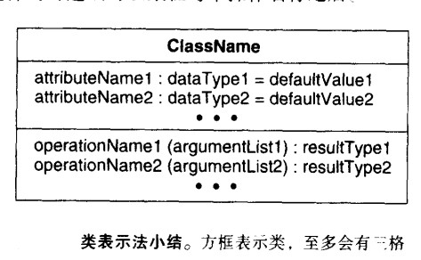

###UML(Unified Modeling Language)统一建模语言

> 过早的专注于实现会限制决策  
> ----《UML面向对象建模和设计》

####schedule
+ 面向对象OO
+ 建模的概念
+ 类建模
+ UML类图
+ 代码与UML图的转化  

####面向对象Object-Orient
1. 抽象（abstract）
2. 封装（encapsulation）
3. 继承
4. 多态

###建模的概念
**模型**是某个事物的抽象，其目的是在构建这个事物之前先来理解它。  
三种相关但不同角度的建模系统：  

+ 类模型
+ 状态模型
+ 交互模型  
类模型那个描述状态摩西那个和交互模型曹祖的数据结构，类模型中的操作对应于事件和动作。状态模型描述对象的控制结构，它显示了依赖于对象取值的
决策，并引发动作来改变对象取值和状态。交互模型专注于对象之间的信息互换，并提供了系统操作的整体视图。

**类模型**描述系统中对象的结构——他们的标识、与其他对象的关系、属性和操作。  
**类图**表达了类模型，**泛化**使得类可以共享结构和行为，**关联**使得类之间发生关系。  
类定义了每个对象所携带的属性值、以及每个对象执行和经历的操作。  

###类建模
> 我们强调要围绕对象而不是功能来构建系统，因为面向对象系统与现实世界更为贴切，所以更容易响应变化。

**对象和类 **
+ 依赖（Dependency）
+ 关联（Association）
+ 聚合（Aggregation）
+ 组合（Composition）
+ 泛化（Generalization）
+ 实现（Realization）  

######类图  
**类图**提供了对类及其关系进行建模的一种图形化的表示法。  
######值和属性--操作和方法  

